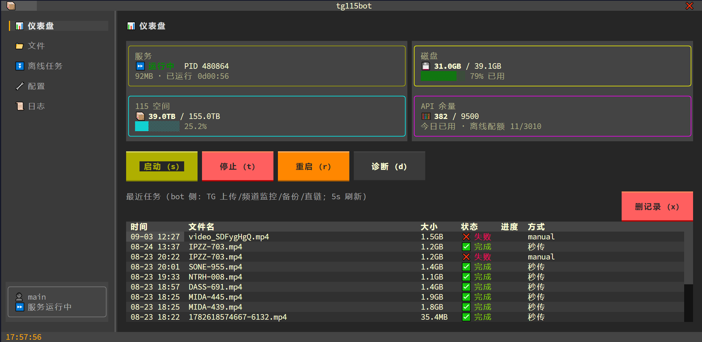
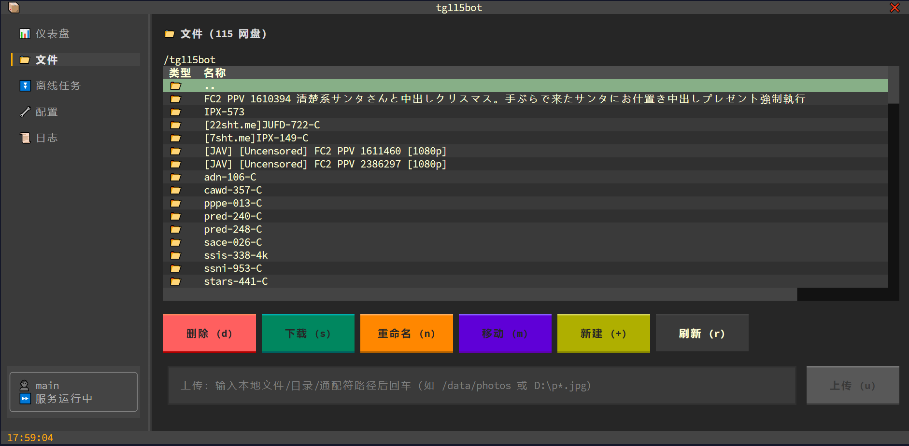
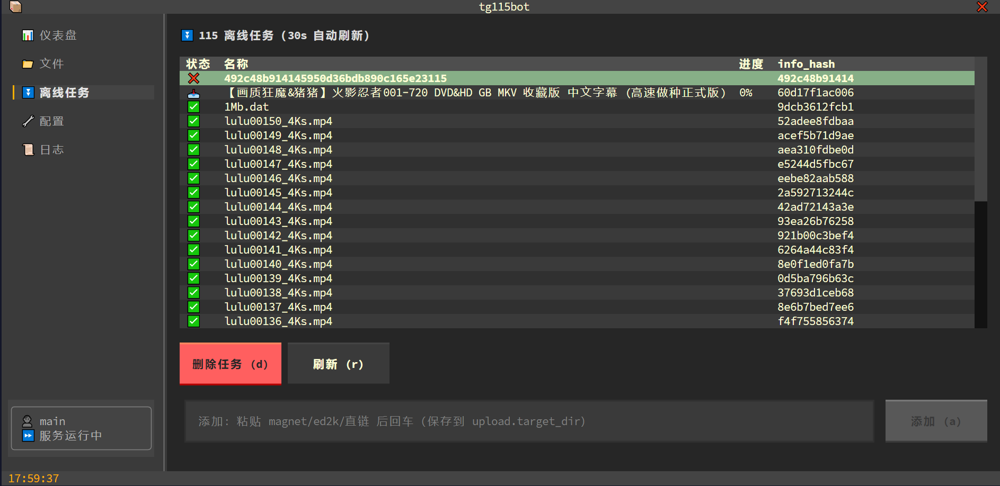
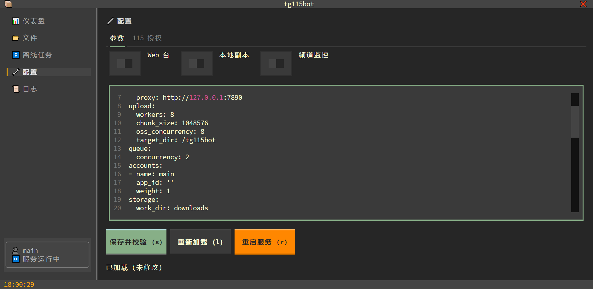
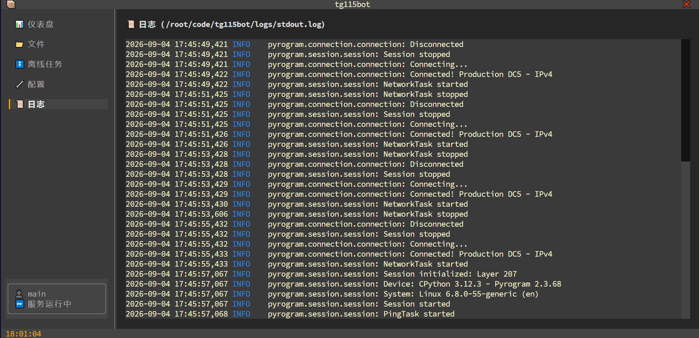

# tg115bot


**tg115bot** 把 Telegram 变成 115 网盘的自动入口：视频、文件、磁力链接发给 bot，剩下的交给它——自动下载、转存、整理归档，全程无人值守。传输走 MTProto 并行分片 + 115 服务端秒传 + OSS 分片直传，大文件也能跑满带宽；频道监控、RSS 订阅、离线下载、整频道回溯备份，让内容自动"流"进网盘；再配一个能用中文对话的 AI 助手，管理网盘不用记命令。跨 Linux / macOS / Windows 一键安装，`tb` 命令行、交互 TUI、Web 管理台三套入口随取随用。


<p align="center"><em>仪表盘：四卡状态 + 最近任务</em></p>


<p align="center"><em>文件：115 网盘远程管理</em></p>


<p align="center"><em>离线任务：磁链 / ed2k / 直链</em></p>


<p align="center"><em>配置：参数 + 115 授权</em></p>


<p align="center"><em>日志：实时跟踪 stdout / 业务日志</em></p>

**目录**：[特性](#特性) · [快速开始](#快速开始) · [tb 命令行](#tb-命令行) · [TG 机器人](#tg-机器人) · [配置项](#配置项) · [项目结构](#项目结构) · [注意事项](#注意事项) · [安全须知](#安全须知)

## 特性

- **高速传输** — MTProto 并行分片下载（bot 单文件 2GB / user session 4GB，绕开 Bot API 20MB 限制）+ 115 服务端秒传 + OSS 分片直传
- **自动搬运** — 频道监控（关键词规则）、RSS 订阅、磁力 / ed2k / 直链 115 离线、整频道回溯备份（断点续传）、115 分享链接自动转存、HTTP 直链本地中转
- **AI 助手** — 任意 OpenAI 兼容模型，一句中文操作全部功能；可按需生成受限沙箱工具（TG 确认后启用）
- **文件整理** — 重命名模板（`{date}_{filename}` 等）+ 按扩展名自动归类子目录
- **一键安装** — Linux / macOS `curl | bash`、Windows `irm | iex`；`tb init` 引导配置与 115 扫码，`tb doctor` 一键体检
- **三套管理入口** — `tb` 命令行（与 `scripts/manual.py` 同构）、交互 TUI、Web 管理台（实时进度 / 任务 / 账号 / 规则 / 日志）
- **多账号** — 加权轮转 + 故障冷却，分摊 115 风控压力
- **零三方 SDK** — 115 开放平台协议与 OSS 签名直传均为手写实现，token 自动刷新
- **数据可靠** — SQLite 持久化（任务 / 规则 / 账号 / 日志重启不丢），双日志 10M 滚动 × 7 天保留
- **部署多样** — 后台服务（SSH 断开不影响）、Docker Compose、Windows 开机自启

## 快速开始

### 一键安装（推荐）

**Linux / macOS**：

```bash
curl -fsSL https://raw.githubusercontent.com/ivenlau/tg115bot/main/scripts/install.sh | bash
```

**Windows PowerShell**：

```powershell
irm https://raw.githubusercontent.com/ivenlau/tg115bot/main/scripts/install.ps1 | iex
```

装完即有 `tb` 命令：

```bash
tb init      # 交互式初始化：依赖 → 虚拟环境 → 代理 → 配置 → 115 扫码 → 可选功能 → 完成
             # 幂等可重跑，已就绪的步骤自动跳过
tb doctor    # 一键体检：环境 / 授权 / 磁盘 / 代理安全 / 服务状态
tb start     # 后台启动服务（SSH 断开不影响）
tb           # 进入交互 TUI；tb --help 看全部命令
```

### Windows 部署

Windows 版不部署代理——自行安装 Clash / v2rayN 等系统代理软件，初始化时把本地监听地址（如 `http://127.0.0.1:7890`）填进 `telegram.proxy`。

```powershell
irm https://raw.githubusercontent.com/ivenlau/tg115bot/main/scripts/install.ps1 | iex
tb init      # 初始化（含可选开始菜单快捷方式）
tb start     # 启动
```

服务管理与 Linux 同构（`start / stop / restart / status / log`）：后台隐藏窗口运行，PID 校验防误杀，日志同样双份滚动。开机自启（可选）：

```powershell
schtasks /Create /SC ONSTART /TN tg115bot /TR "powershell -ExecutionPolicy Bypass -File <项目路径>\scripts\service.ps1 start"
```

或源码方式：`git clone` 后 `powershell -ExecutionPolicy Bypass -File scripts\init.ps1`。

### Docker 部署

```bash
# 1. 若需代理（国内服务器访问 TG），先在宿主机部署 mihomo
sudo ./scripts/setup-mihomo.sh <订阅地址>

# 2. 配置
cp config.yaml.example config.yaml    # 基础配置；telegram 段可留空，交给 .env 覆盖
cp .env.example .env                  # 填 telegram 段；代理填 http://host.docker.internal:7890

# 3. 启动 / 看日志
docker compose up -d --build
docker compose logs -f
```

### 手动安装

<details>
<summary>展开手动步骤</summary>

```bash
# 1. 依赖（Python >= 3.12；pyrofork 为 pyrogram 维护分支，API 一致）
python3.12 -m venv .venv && source .venv/bin/activate
pip install -r requirements.txt

# 2. 配置
cp config.yaml.example config.yaml    # 填 telegram 段与 proxy
# api_id / hash: https://my.telegram.org ；bot_token: @BotFather
# 国内服务器 proxy: "http://127.0.0.1:7890"（mihomo 混合端口）

# 3. 115 授权（终端二维码扫码）
python scripts/check115.py --auth

# 4. 前台运行（调试用；长期运行建议 service.sh）
python main.py
```

可选：`python scripts/check115.py` 跑一次上传链路自检（会在 115 留 3 个测试文件，可删）。

</details>

## tb 命令行

`tb` 是统一命令行入口，与 `scripts/manual.py` 子命令同构、参数完全一致（在安装目录直接跑 `python scripts/manual.py` 亦可）。无参数运行进交互菜单；未授权先 `tb auth`。

### 服务管理

| 命令 | 说明 |
|---|---|
| `tb start / stop / restart` | 后台启动 / 优雅停止（10s 后强杀进程树）/ 重启 |
| `tb status` | 状态：PID / 内存 / 运行时长 |
| `tb log [N]` | 跟踪日志（默认尾部 50 行，Ctrl+C 退出） |
| `tb update` | 更新代码 + 刷新依赖，之后 `tb restart` 生效 |

PID 文件防重复启动（校验进程命令行，防 PID 复用误杀）；双日志 `logs/stdout.log` + `logs/tg115bot.log` 统一 10M 滚动、7 天保留。

### 115 操作（不依赖 Telegram）

```bash
tb ls /tg115bot                                   # 列目录（--all 翻页取全部）
tb search 关键词                                   # 全盘搜索
tb upload /data/photos -d /tg115bot/photos        # 目录递归；也支持通配符 '/data/p*.jpg'
tb download /tg115bot/a.mkv -o ~/Downloads        # 下载到本地（sha1 校验；v1 仅单文件）
tb offline add "magnet:?xt=…" -d /tg115bot/bt     # 添加离线
tb offline list -a                                # 离线任务（-a 全部页）
tb offline del <info_hash> --purge                # 删任务（--purge 连源文件）
tb mkdir /tg115bot/newdir                         # 还有 mv / rename / rm（rm 默认需确认）
tb df                                             # 空间 / 离线配额 / 风控水位
tb share save "https://115.com/s/xxx?password=码"  # 分享转存（需 share.cookies）
tb auth                                           # 扫码（重新）授权 / 强刷 token
tb -a b2 df                                       # 多账号时指定账号
```

退出码：`0` 成功 / `1` 失败 / `2` 需重新扫码授权（cron 可判断）。

### 运维

`tb init`（初始化）/ `tb doctor`（体检）/ `tb mihomo <订阅>`（代理）/ `tb session`（user session）/ `tb version`；`tb --install-completion` 装 shell 补全。裸 `tb` 进 TUI，`tb menu` 进 Rich 菜单。

代理订阅过期 / 换机场时（mihomo 节点全挂、TG 失联）：

```bash
sudo scripts/setup-mihomo.sh <新订阅地址>    # 自动备份旧配置并实测连通性
tb restart                                 # bot 重连
```

## TG 机器人

向 bot 发送视频 / 文件即可，自动上传到 `upload.target_dir` 指定的 115 目录。

### 机器人命令

| 命令 | 说明 |
|---|---|
| `/start` `/help` | 帮助 |
| `/setdir <115路径>` | 设置目标目录（如 `/tg115bot/movies`） |
| `/auth` | 授权 / 检查 115 账号状态 |
| `/cancel` | 取消最近一个进行中的任务 |
| `/status` | 115 空间 / 离线配额 / 风控余量 / 账号 / 队列一览 |
| `/ls <路径>` | 列 115 目录 |
| `/search <关键词>` | 115 全盘搜索 |
| `/rm <路径>` | 删除（二次确认） |
| `/mv <源> <目的目录>` | 移动 |
| `/offline <链接>` | 115 离线下载（磁力 / ed2k / 直链；**直接发链接也可**） |
| `/offlines` | 查看离线任务队列 |
| `/dl <http直链>` | 本地中转下载后上传 |
| `/channels` | 查看频道监控规则 |
| `/addchannel <频道ID> <目标目录> [关键词...]` | 新增频道规则（关键词为白名单，留空=全部） |
| `/delchannel <规则ID>` | 删除频道规则 |
| `/addrss <RSS地址> [目录] [关键词...]` | 订阅 RSS 自动离线（关键词=标题白名单，空=全部） |
| `/rsss` `/delrss <ID>` | 查看 / 退订 RSS |
| `/backup <频道ID或@名> [目录]` | 整频道历史备份（断点续传） |
| `/backups` `/backupstop <ID>` | 备份进度 / 暂停 |
| `/ai` `/aireset` `/aitools` | AI 模式开关 / 清空记忆 / 管理动态工具 |

### 离线下载与转存

磁力 / ed2k / 种子及媒体直链直接发给 bot 即自动离线下载（或 `/offline <链接>`）：资源在 **115 服务器**下载，不占本地带宽、不经代理；完成自动通知，失败自动重试 2 次；`/offlines` 查看队列。

115 分享链接（`https://115.com/s/xxx?password=访问码`）自动转存到 `share.target_dir`（需配置 `share.cookies`，浏览器登录后复制）；`/dl <直链>` 走本地中转下载再上传（经 `telegram.proxy`），适合 115 离线不支持或速度慢的源。

### 频道监控

1. 将 bot 加入目标频道（频道 ID 可在 TG 内转发消息给 `@userinfobot` 获取）；
2. `channel_monitor.enabled: true`；
3. 用 `/addchannel` 或 Web 台添加规则（关键词白 / 黑名单 + 目标目录）。

### RSS 订阅

```text
/addrss https://example.com/feed.xml /tg115bot/pt 1080p HEVC
```

每 10 分钟检查全部订阅源；条目标题命中关键词（留空=全部）且含可下载链接时自动离线，重复条目自动去重。RSS 源经 `telegram.proxy` 抓取。

### 频道回溯备份

```text
/backup -1001234567890 /tg115bot/archive
```

从最新消息向历史回溯，媒体全部入队上传（若该频道配了监控规则则按关键词过滤）。**断点续传**：中断后重发命令自动从上次位置继续（`kill -9` 也不丢进度）；`/backups` 查看进度，`/backupstop` 暂停。

### AI 助手（可选）

```yaml
ai:
  base_url: "https://api.deepseek.com/v1"   # 任意 OpenAI 兼容端点
  api_key: "sk-..."
  model: "deepseek-chat"
```

配置后普通文本消息即进入 AI 对话（命令与链接识别不受影响），例如：

- "把网盘里的电影挪到 /media，只要 4K" → `search_115` + `move_115`
- "网盘还有多少空间？离线配额呢？" → 调 `full_status` 汇报
- "订阅这个 RSS，只要 1080p 以上" → `rss_add` + 关键词

AI 可调用全部内置工具（18 个）；需要新能力时它会写一个受限沙箱内的 Python 小工具，**经你在 TG 点确认后**才启用（`/aitools` 管理）。会话记忆持久化，重启不丢；`/ai off` 临时停用。

### Web 管理台（可选）

`web.enable: true` 后浏览器打开 `http://<host>:<port>/`（HTTP Basic 认证，凭据见 `config.web`）：仪表盘实时进度（3s 刷新）、`/tasks` 任务历史、`/accounts` 账号状态、`/channels` 规则在线增删、`/logs` 日志。

## 配置项

完整说明见 `config.yaml.example` 内注释。常用：

| 键 | 默认 | 说明 |
|---|---|---|
| `telegram.proxy` | 空 | TG 代理（`socks5://` 或 `http://`）；115 不走代理 |
| `telegram.user_session` | 空 | user session 提升下载额度、缓解 FloodWait（Premium 可下 4GB）；`python scripts/make_session.py` 生成 |
| `upload.target_dir` | `/tg115bot` | 115 默认目标目录 |
| `upload.workers` | 8 | TG 并行下载分片数 |
| `upload.oss_concurrency` | 8 | OSS 分片并发数 |
| `queue.concurrency` | 2 | 同时处理的任务数 |
| `accounts[].app_id` | 空 | 开放平台 AppID（空=内置公共 ID）；多账号配多条 + `weight` 权重 |
| `organize.rename_template` | `{filename}` | 重命名模板（`{date}/{name}/{ext}` 等） |
| `organize.classify_by_ext` | false | 按扩展名归入子目录 |
| `channel_monitor.enabled` | false | 频道监控开关 |
| `share.cookies` | 空 | 分享转存凭据（浏览器 Cookie；空=停用转存） |
| `ai.base_url / api_key / model` | 空 | AI 助手（OpenAI 兼容；空=停用） |
| `web.enable` | false | Web 管理台开关 |
| `storage.min_free_gb` | 5 | 磁盘可用空间下限，低于则暂停接新任务 |
| `storage.keep_local` | false | true 时上传成功后保留本地副本到 `<work_dir>/copies/`；任务失败时保留 `.part` 现场 |

环境变量可覆盖任意配置：`TG115BOT__段__键=值`（双下划线分层，如 `TG115BOT__TELEGRAM__BOT_TOKEN`）。

## 项目结构

```
tg115bot/
├── main.py                # 入口
├── config.py              # 配置加载（yaml + 环境变量覆盖）
├── tb/                    # 统一命令行包：CLI（Typer）+ TUI（Textual）+ 跨平台服务管理
├── bot/                   # TG 客户端、命令处理、频道监控
├── core/                  # 下载/上传/离线/RSS/备份/直链/队列/整理
├── ai/                    # AI 助手：LLM 客户端/工具集/agent 循环/动态工具沙箱
├── cloud115/              # 115 开放平台 + OSS 直传协议实现
├── persistence/           # SQLite 持久化
├── web/                   # Web 管理台（FastAPI + HTMX）
├── utils/                 # 限速/退避、凭据加密、日志
├── tests/                 # 单元测试（python tests/run_all.py）
└── scripts/
    ├── install.sh         # 一键安装（curl | bash；克隆+venv+tb shim）
    ├── install.ps1        # Windows 一键安装（irm | iex）
    ├── init.sh            # 交互式初始化（依赖/代理/配置/授权 7 步）
    ├── service.sh         # 服务管理（start/stop/restart/status/log）
    ├── setup-mihomo.sh    # mihomo 代理部署/订阅更新（含安全加固）
    ├── init.ps1           # Windows 版初始化（不含代理部署）
    ├── service.ps1        # Windows 版服务管理
    ├── menu.ps1           # Windows 快捷管理菜单
    ├── check115.py        # 115 授权与链路自检
    ├── manual.py          # 115 手动运维 CLI（交互菜单 + 子命令；tb 的数据层）
    ├── make_session.py    # 生成 TG user session
    └── healthcheck.py     # 容器健康检查
```

## 注意事项

- 115 风控：内置请求最小间隔 + 抖动 + 指数退避，请勿把并发调得过高。
- token 过期自动刷新；彻底失效时 `/auth` 重新扫码即可。
- 大文件全程流式处理（预分配 + 分片 seek 写盘），不占额外内存。
- `downloads/` 为临时目录，上传成功后自动清理（`storage.keep_local: true` 时成功保留副本、失败保留现场）。

## 安全须知

- **mihomo 代理加固**：`setup-mihomo.sh` 在订阅落地后强制覆写——代理端口源 IP 白名单（仅本机 / 内网 / Docker 网段）、控制 API 只监听 `127.0.0.1:9090`，公网来源直接拒绝。
- **云服务器安全组是最后防线**：只放行确实需要的端口（SSH、Web 台）；**绝不要放行 7890 / 9090**（代理端口 / 控制 API）。Web 台如需公网访问，务必限制源 IP 并修改默认密码（明文 HTTP Basic 认证）。
- **为什么重要**：公网上的开放代理会被全网扫描器在数小时内盯上，被用来刷流量、中转垃圾邮件，足以耗尽小服务器的 CPU / 内存 / 磁盘。`init.sh` 检测到 mihomo 监听公网且无白名单时会明确告警。

## 免责声明

仅供个人学习与合法的网盘文件管理使用。请遵守当地法律法规及 115 / Telegram 服务条款，使用风险自负。

## 许可证

[MIT](LICENSE) © 2026 ivenlau
